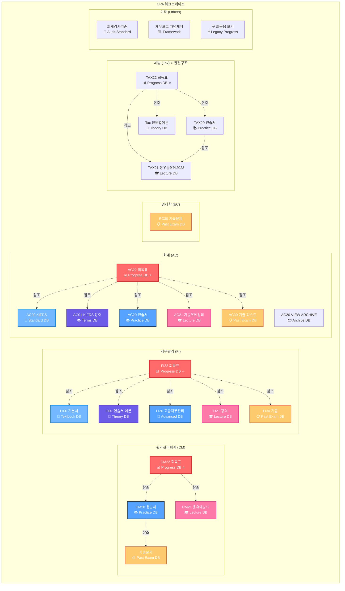

# CPA 노션 워크스페이스 완전 데이터베이스 아키텍처

## 🎯 과목코드 체계 (Subject Codes)

| 코드 | 과목명 | 영문명 |
|------|--------|--------|
| **CM** | 원가관리회계 | Cost Management |
| **FI** | 재무관리 | Finance |
| **AC** | 회계 | Accounting |
| **EC** | 경제학 | Economics |
| **Tax** | 세법 | Tax Law |

## 📖 DB번호 규칙 (Database Number Rules)

| 번호 | 용도 | 설명 | 주요 기능 |
|------|------|------|----------|
| **00** | 기본서 | Basic Textbook | 기초 이론 학습 |
| **01** | 연습서/이론 | Practice/Theory | 심화 이론 및 용어 정리 |
| **20** | 고급/용습서 | Advanced/Terms | 고급 문제집, 용어 습득 |
| **21** | 강의 | Lectures | 강의 진도 및 노트 |
| **22** | 회독표 | Reading Progress | 학습 진도 관리 ***(핵심 Task 관리)*** |
| **30** | 기출문제 | Past Exams | 기출문제 아카이브 |

## 🏗️ 전체 데이터베이스 아키텍처



## 📊 과목별 데이터베이스 매트릭스

| 과목 | 00<br/>기본서 | 01<br/>이론 | 20<br/>고급 | 21<br/>강의 | 22<br/>회독표⭐ | 30<br/>기출 |
|------|:---:|:---:|:---:|:---:|:---:|:---:|
| **CM** | ❌ | ❌ | ✅ 용습서 | ✅ 용유예 | ✅ | ✅ |
| **FI** | ✅ | ✅ | ✅ 고급 | ✅ | ✅ | ✅ |
| **AC** | ✅ KIFRS | ✅ 용어 | ✅ 연습서 | ✅ 기동유예 | ✅ | ✅ |
| **EC** | ❌ | ❌ | ❌ | ❌ | ❌ | ✅ |
| **Tax** | ❌ | ✅ 단원별 | ✅ 연습서 | ✅ 정우승유예 | ✅ | ❌* |

*Tax 기출은 TAX20 연습서에 기출연도별로 통합 관리

## 🔗 주요 관계형 구조 (Primary Relationships)

### 📊 회독표 (22번 DB) - 핵심 Project Management
```
회독표 (Progress DB) ⭐ 
├── 📚 교재 Relations
│   ├── → 용습서/연습서 (20번)
│   ├── → 강의 (21번) 
│   └── → 기출문제 (30번)
├── 📝 Primary Keys
│   ├── id (시스템 생성 UUID)
│   ├── 제목 (Title)
│   └── Chapter (분류)
└── 📊 Progress Tracking
    ├── 진행률 (0~1.0)
    ├── 푼날짜시간 (Date)
    └── 코멘트/취약점
```

### 📚 교재 시스템 (20-21번 DB) - Content Management  
```
용습서/연습서 (Practice DB)
├── 🔗 Relations
│   ├── ← 회독표 (22번)
│   ├── → 강의 (21번)
│   └── → 기출문제 (30번)
├── 📖 Content Structure
│   ├── Chapter (단원)
│   ├── Category (목차/예제/실전)
│   └── 표준유형분류 (난이도)
└── 📊 Metadata
    ├── 기출연도
    ├── Tags (중요도/유형)
    └── FSS분류 (공식)
```

### 📋 기출문제 (30번 DB) - Archive System
```
기출문제 (Past Exam DB)
├── 📅 Time Series
│   ├── 연도 (1990~2024)
│   ├── 1차/2차/CTA 구분
│   └── 문제번호
├── 🏷️ Classification  
│   ├── Chapter/FSS분류
│   ├── 난이도 (임상/임중/임하)
│   └── 배점
└── 🔗 Cross References
    ├── → 용습서 (20번)
    └── → 유사문제 (Self)
```

## 🎯 Primary Key 및 인덱싱 전략

### 🔑 Universal Primary Keys
- **id**: 모든 DB 공통 시스템 생성 UUID (Primary Key)
- **url**: 노션 페이지 고유 URL (Alternative Key)

### 📊 과목별 인덱싱 컬럼

#### CM (원가관리회계)
```sql
-- CM22 회독표 (핵심 Task DB)
PRIMARY KEY: id
INDEXES: 
  - 🟣Chapter (C101~C223)
  - 📅푼날짜시간 (Date filtering)
  - 🔋진행률 (Progress tracking)
  - 😈용유예강의 (Lecture relation)
  
-- CM20 용습서 (Practice DB)  
PRIMARY KEY: id
INDEXES:
  - 🟣Chapter (C101~C223)
  - 🗂️Category (목차/예제/실전/심화)
  - 🗂️기출연도 (1990~2024)
  - 🗂️표준유형분류 (1N~5R)
```

#### FI (재무관리)
```sql
-- FI22 회독표 (Progress DB)
PRIMARY KEY: id
INDEXES:
  - Chapter (재무관리 단원별)
  - 진행률/날짜
  - Relations to FI00~FI30
  
-- FI00~FI30 각 DB
PRIMARY KEY: id  
INDEXES:
  - Chapter/단원별
  - 연도별 (기출)
  - 난이도별
```

#### AC (회계)
```sql
-- AC22 회독표 (Progress DB)
PRIMARY KEY: id
INDEXES:
  - Chapter (KIFRS 기준)
  - 진행률/날짜
  - Relations to AC00~AC30

-- AC00 KIFRS (Standard DB)
PRIMARY KEY: id
INDEXES:
  - KIFRS 번호별
  - 주제별 분류
```

#### EC (경제학)
```sql
-- EC30 기출문제 (Past Exam DB)
PRIMARY KEY: id
INDEXES:
  - 🗂️기출연도 (Time series)
  - 🟣목차 (Economics topics)
  - 🟣FSS목차 (EC101~EC302)
  - ⭐중요도 (Priority)
```

#### Tax (세법) ⭐ **완전 구조**
```sql
-- TAX22 회독표 (Progress DB) ⭐
PRIMARY KEY: id
INDEXES:
  - 🟣Chapter (100~500번대 체계)
  - 🗂️법소부 (1.법인~5.국기)
  - 📅푼날짜시간 (Date tracking)
  - 🔋진행률 (Progress status)
  - Relations: 단원별이론, 연습서, 강의

-- TAX20 연습서 (Practice DB)
PRIMARY KEY: id  
INDEXES:
  - 🟣Chapter (100~500번대)
  - 🗂️Category (워크북/연습서/모의고사)
  - 🗂️기출연도 (2005~2024, CTA 포함)
  - 정우승2기 01~10회차 세분화

-- TAX21 정우승유예2023 (Lecture DB)
PRIMARY KEY: id
INDEXES:
  - Chapter (100~500번대)
  - 법소부 (1.법인~4.상증)
  - 강의날짜 (유예9월/11월/동차때)
  - Relations: 연습서, 회독표

-- Tax 단원별이론 (Theory DB)
PRIMARY KEY: id
INDEXES:
  - 법소부 (법인/소득/부가/상증/국기)
  - Chapter/IntegratedCode
  - Recursive (Self-relation)
```

## 📈 데이터베이스 완전성 검증 요구사항

### 🔍 Row Count 확인 필요 항목
1. **CM22 회독표**: 원가관리 전체 문제 수 (500-800 rows)
2. **FI22 회독표**: 재무관리 전체 문제 수 (400-600 rows)
3. **AC22 회독표**: 회계 전체 문제 수 (600-1000 rows)
4. **TAX22 회독표**: 세법 전체 문제 수 (300-500 rows) ⭐
5. **CM30 기출문제**: 원가관리 기출 (1990~2024)
6. **FI30 기출**: 재무관리 기출 (1990~2024)
7. **AC30 기출**: 회계 기출 (1990~2024)
8. **EC30 기출**: 경제학 기출 (1990~2024)
9. **TAX20 연습서**: 세법 기출 통합관리 (2005~2024)

### 🔗 관계 무결성 검증
- 회독표 ↔ 교재 Relations 일관성
- 기출문제 ↔ 용습서 Cross-reference 완전성
- Chapter 분류 표준화 확인

## 🚀 Deep Research 최적화 쿼리 전략

### 1단계: 과목별 진도 현황
```
"[과목코드]22 회독표" + "진행률" + "날짜범위"
예: "CM22 회독표 진행률 0.5 이상"
```

### 2단계: 주제별 문제 분석
```  
"[과목코드]20" + "Chapter" + "유형분류"
예: "CM20 용습서 C211 CVP분석 1N 기본개념"
```

### 3단계: 기출 패턴 분석
```
"[과목코드]30 기출" + "연도범위" + "Chapter"
예: "FI30 기출 2020-2024 자본예산"
```

### 4단계: 교차 검증 쿼리
```
"[주제명]" (전과목 통합 검색)
예: "CVP" → CM, AC 등 관련 과목 모든 자료
```

## 📊 ASCII 다이어그램 - 전체 시스템 아키텍처

```
CPA 노션 워크스페이스 (총 25개 DB, 3500-6000 rows)
│
├── 원가관리회계 (CM) ────────────────────────────────────
│   ├── CM20 용습서        [300-500 rows] 📚 Practice
│   │   ├── Chapter: C101-C223 (24개)
│   │   ├── Category: 목차/예제/실전/심화/기출
│   │   └── 표준유형분류: 1N-5R (난이도별)
│   │
│   ├── CM21 용유예강의    [100-200 rows] 🎓 Lecture
│   │   └── Pattern: [007강] 단원명
│   │
│   ├── CM22 회독표 ⭐     [500-800 rows] 📊 CORE Progress
│   │   ├── Relations: CM20, CM21, CM30
│   │   ├── 진행률: 0~1.0 
│   │   └── 📅 푼날짜시간 (Time tracking)
│   │
│   └── CM30 기출문제      [200-400 rows] 📋 Past Exam
│       └── Years: 1990-2024 (35년간)
│
├── 재무관리 (FI) ──────────────────────────────────────
│   ├── FI00 기본서       [100-200 rows] 📖 Textbook
│   ├── FI01 연습서 이론   [150-250 rows] 📝 Theory  
│   ├── FI20 고급재무관리  [200-300 rows] 🎯 Advanced
│   ├── FI21 강의         [100-150 rows] 🎓 Lecture
│   ├── FI22 회독표 ⭐     [400-600 rows] 📊 CORE Progress
│   └── FI30 기출         [200-350 rows] 📋 Past Exam
│
├── 회계 (AC) ─────────────────────────────────────────
│   ├── AC00 KIFRS        [200-300 rows] 📜 Standard
│   ├── AC01 KIFRS 용어    [300-500 rows] 📚 Terms
│   ├── AC20 연습서       [400-600 rows] 📚 Practice
│   ├── AC20-V ARCHIVE    [100-200 rows] 🗂️ Archive
│   ├── AC21 기동유예강의  [100-200 rows] 🎓 Lecture
│   ├── AC22 회독표 ⭐     [600-1000 rows] 📊 CORE Progress
│   └── AC30 기출 리스트   [300-500 rows] 📋 Past Exam
│
├── 경제학 (EC) ────────────────────────────────────────
│   └── EC30 기출문제     [150-300 rows] 📋 Past Exam
│       └── FSS: EC101-EC302 (18개 분야)
│
├── 세법 (Tax) ─────────────────────────────────────────
│   └── Tax 단원별이론    [100-200 rows] 📝 Theory
│       └── 법소부: 법인/소득/부가/상증/국기
│
└── 기타 (Others) ──────────────────────────────────────
    ├── 회계감사기준      [50-100 rows] 📜 Audit
    ├── 재무보고 개념체계  [50-100 rows] 🏗️ Framework
    └── (구) 회독용 보기   [Legacy] 🗄️ Archive

═══════════════════════════════════════════════════════

🔑 Primary Key 구조:
   id (UUID) ──→ 모든 DB 공통 Primary Key
   url ────────→ 노션 페이지 고유 URL (Alternative Key)

🔗 핵심 Relations:
   회독표(22) ←→ 교재(20) ←→ 강의(21) ←→ 기출(30)
   │
   └── 📊 Project-Task 관계
       회독표 = Project Management
       교재/강의/기출 = Task Resources

📈 완전성 검증 우선순위:
   1. CM22, FI22, AC22 (핵심 회독표) ⭐⭐⭐
   2. CM30, FI30, AC30, EC30 (기출문제)
   3. CM20, FI20, AC20 (교재/문제집)
   4. 기타 이론/강의 DB
```

## 🎯 Deep Research 활용 최종 가이드

### 즉시 사용 가능한 최적화 쿼리
```bash
# 진도 관리 (회독표 중심)
"CM22 회독표 진행률 0.5"     # 원가관리 50% 완료 문제들
"FI22 회독표 C211 CVP"      # 재무관리 CVP 관련 문제들
"AC22 회독표 최근 1주일"     # 회계 최근 학습 항목들
"TAX22 회독표 법인세"       # 세법 법인세 관련 문제들

# 교재별 문제 검색  
"CM20 용습서 1N 기본개념"    # 원가관리 기본 개념 문제들
"FI01 연습서 자본예산"       # 재무관리 이론 자본예산
"AC20 연습서 KIFRS"         # 회계 연습서 KIFRS 문제들
"TAX20 연습서 워크북"       # 세법 워크북 문제들

# 기출문제 패턴 분석
"CM30 2020-2024 1차"       # 원가관리 최근 5년 1차 기출
"FI30 기출 옵션"           # 재무관리 옵션 관련 기출
"EC30 미시경제 2024"       # 경제학 미시경제 2024년
"TAX20 2024 정우승2기"     # 세법 2024 정우승 2기

# 교차 검증 쿼리
"CVP"                      # 전과목 CVP 관련 모든 자료
"2024 [문제05]"           # 2024년 문제05 모든 과목
"표준원가"                 # 표준원가 관련 전체 자료
"법인세"                   # 세법 법인세 관련 전체 자료
```

### 완전성 검증 체크리스트
- [ ] CM22 회독표: 500-800 rows 확인
- [ ] FI22 회독표: 400-600 rows 확인  
- [ ] AC22 회독표: 600-1000 rows 확인
- [ ] TAX22 회독표: 300-500 rows 확인 ⭐
- [ ] 기출문제 연도별 완전성: 1990-2024
- [ ] Chapter 분류 표준화 확인 (특히 Tax 100~500번대)
- [ ] Relations 무결성 검증 (회독표↔교재↔강의)
- [ ] Tax 법소부 분류 일관성 (1.법인~5.국기)

이 완전한 아키텍처를 통해 CPA 학습의 모든 영역을 체계적으로 분석하고 관리할 수 있습니다! 🎯