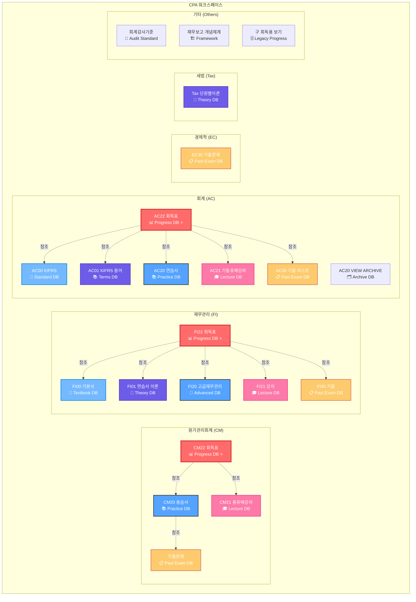

# CPA 노션 워크스페이스 완전 데이터베이스 아키텍처

## 🎯 과목코드 체계 (Subject Codes)

| 코드 | 과목명 | 영문명 |
|------|--------|--------|
| **CM** | 원가관리회계 | Cost Management |
| **FI** | 재무관리 | Finance |
| **AC** | 회계 | Accounting |
| **EC** | 경제학 | Economics |
| **Tax** | 세법 | Tax Law |

## 📖 DB번호 규칙 (Database Number Rules)

| 번호 | 용도 | 설명 | 주요 기능 |
|------|------|------|----------|
| **00** | 기본서 | Basic Textbook | 기초 이론 학습 |
| **01** | 연습서/이론 | Practice/Theory | 심화 이론 및 용어 정리 |
| **20** | 고급/용습서 | Advanced/Terms | 고급 문제집, 용어 습득 |
| **21** | 강의 | Lectures | 강의 진도 및 노트 |
| **22** | 회독표 | Reading Progress | 학습 진도 관리 ***(핵심 Task 관리)*** |
| **30** | 기출문제 | Past Exams | 기출문제 아카이브 |

## 🏗️ 전체 데이터베이스 아키텍처



## 📊 과목별 데이터베이스 매트릭스

| 과목 | 00<br/>기본서 | 01<br/>이론 | 20<br/>고급 | 21<br/>강의 | 22<br/>회독표⭐ | 30<br/>기출 |
|------|:---:|:---:|:---:|:---:|:---:|:---:|
| **CM** | ❌ | ❌ | ✅ 용습서 | ✅ 용유예 | ✅ | ✅ |
| **FI** | ✅ | ✅ | ✅ 고급 | ✅ | ✅ | ✅ |
| **AC** | ✅ KIFRS | ✅ 용어 | ✅ 연습서 | ✅ 기동유예 | ✅ | ✅ |
| **EC** | ❌ | ❌ | ❌ | ❌ | ❌ | ✅ |
| **Tax** | ❌ | ✅ 단원별 | ❌ | ❌ | ❌ | ❌ |

## 🔗 주요 관계형 구조 (Primary Relationships)

### 📊 회독표 (22번 DB) - 핵심 Project Management
```
회독표 (Progress DB) ⭐ 
├── 📚 교재 Relations
│   ├── → 용습서/연습서 (20번)
│   ├── → 강의 (21번) 
│   └── → 기출문제 (30번)
├── 📝 Primary Keys
│   ├── id (시스템 생성 UUID)
│   ├── 제목 (Title)
│   └── Chapter (분류)
└── 📊 Progress Tracking
    ├── 진행률 (0~1.0)
    ├── 푼날짜시간 (Date)
    └── 코멘트/취약점
```

### 📚 교재 시스템 (20-21번 DB) - Content Management  
```
용습서/연습서 (Practice DB)
├── 🔗 Relations
│   ├── ← 회독표 (22번)
│   ├── → 강의 (21번)
│   └── → 기출문제 (30번)
├── 📖 Content Structure
│   ├── Chapter (단원)
│   ├── Category (목차/예제/실전)
│   └── 표준유형분류 (난이도)
└── 📊 Metadata
    ├── 기출연도
    ├── Tags (중요도/유형)
    └── FSS분류 (공식)
```

### 📋 기출문제 (30번 DB) - Archive System
```
기출문제 (Past Exam DB)
├── 📅 Time Series
│   ├── 연도 (1990~2024)
│   ├── 1차/2차/CTA 구분
│   └── 문제번호
├── 🏷️ Classification  
│   ├── Chapter/FSS분류
│   ├── 난이도 (임상/임중/임하)
│   └── 배점
└── 🔗 Cross References
    ├── → 용습서 (20번)
    └── → 유사문제 (Self)
```

## 🎯 Primary Key 및 인덱싱 전략

### 🔑 Universal Primary Keys
- **id**: 모든 DB 공통 시스템 생성 UUID (Primary Key)
- **url**: 노션 페이지 고유 URL (Alternative Key)

### 📊 과목별 인덱싱 컬럼

#### CM (원가관리회계)
```sql
-- CM22 회독표 (핵심 Task DB)
PRIMARY KEY: id
INDEXES: 
  - 🟣Chapter (C101~C223)
  - 📅푼날짜시간 (Date filtering)
  - 🔋진행률 (Progress tracking)
  - 😈용유예강의 (Lecture relation)
  
-- CM20 용습서 (Practice DB)  
PRIMARY KEY: id
INDEXES:
  - 🟣Chapter (C101~C223)
  - 🗂️Category (목차/예제/실전/심화)
  - 🗂️기출연도 (1990~2024)
  - 🗂️표준유형분류 (1N~5R)
```

#### FI (재무관리)
```sql
-- FI22 회독표 (Progress DB)
PRIMARY KEY: id
INDEXES:
  - Chapter (재무관리 단원별)
  - 진행률/날짜
  - Relations to FI00~FI30
  
-- FI00~FI30 각 DB
PRIMARY KEY: id  
INDEXES:
  - Chapter/단원별
  - 연도별 (기출)
  - 난이도별
```

#### AC (회계)
```sql
-- AC22 회독표 (Progress DB)
PRIMARY KEY: id
INDEXES:
  - Chapter (KIFRS 기준)
  - 진행률/날짜
  - Relations to AC00~AC30

-- AC00 KIFRS (Standard DB)
PRIMARY KEY: id
INDEXES:
  - KIFRS 번호별
  - 주제별 분류
```

#### EC (경제학)
```sql
-- EC30 기출문제 (Past Exam DB)
PRIMARY KEY: id
INDEXES:
  - 🗂️기출연도 (Time series)
  - 🟣목차 (Economics topics)
  - 🟣FSS목차 (EC101~EC302)
  - ⭐중요도 (Priority)
```

#### Tax (세법)
```sql
-- Tax 단원별이론 (Theory DB)
PRIMARY KEY: id
INDEXES:
  - 법소부 (법인/소득/부가/상증/국기)
  - Chapter/IntegratedCode
  - Recursive (Self-relation)
```

## 📈 데이터베이스 완전성 검증 요구사항

### 🔍 Row Count 확인 필요 항목
1. **CM22 회독표**: 원가관리 전체 문제 수
2. **FI22 회독표**: 재무관리 전체 문제 수  
3. **AC22 회독표**: 회계 전체 문제 수
4. **CM30 기출문제**: 원가관리 기출 (1990~2024)
5. **FI30 기출**: 재무관리 기출 (1990~2024)
6. **AC30 기출**: 회계 기출 (1990~2024)
7. **EC30 기출**: 경제학 기출 (1990~2024)

### 🔗 관계 무결성 검증
- 회독표 ↔ 교재 Relations 일관성
- 기출문제 ↔ 용습서 Cross-reference 완전성
- Chapter 분류 표준화 확인

## 🚀 Deep Research 최적화 쿼리 전략

### 1단계: 과목별 진도 현황
```
"[과목코드]22 회독표" + "진행률" + "날짜범위"
예: "CM22 회독표 진행률 0.5 이상"
```

### 2단계: 주제별 문제 분석
```  
"[과목코드]20" + "Chapter" + "유형분류"
예: "CM20 용습서 C211 CVP분석 1N 기본개념"
```

### 3단계: 기출 패턴 분석
```
"[과목코드]30 기출" + "연도범위" + "Chapter"
예: "FI30 기출 2020-2024 자본예산"
```

### 4단계: 교차 검증 쿼리
```
"[주제명]" (전과목 통합 검색)
예: "CVP" → CM, AC 등 관련 과목 모든 자료
```

이 아키텍처를 통해 CPA 학습의 모든 영역을 체계적으로 분석하고 관리할 수 있습니다! 🎯